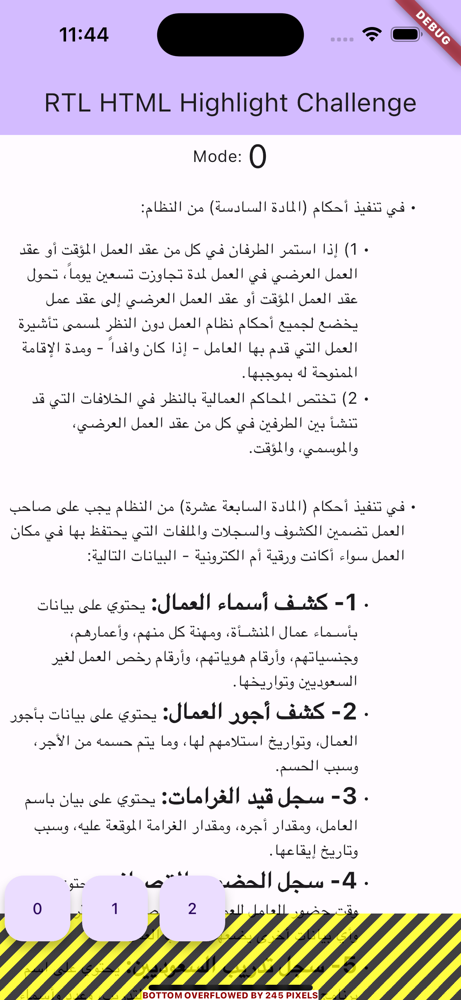
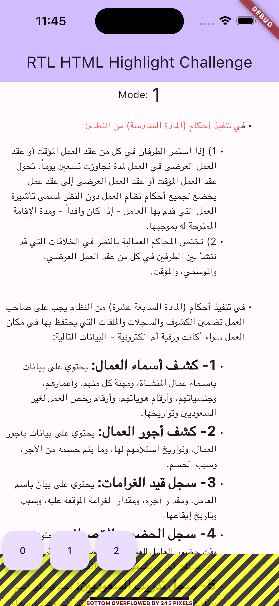
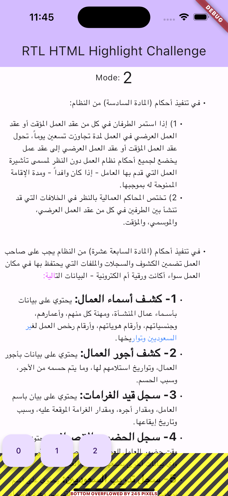

# ltr_html_text_highlight_source

Challenge:

the challenge is in how to highlight the text within multiple tags like "strong" and "li".. etc
i am going to give you a paragraph written in html and start , end index with (highlights data). Start and end index will be walk in multi tags.

